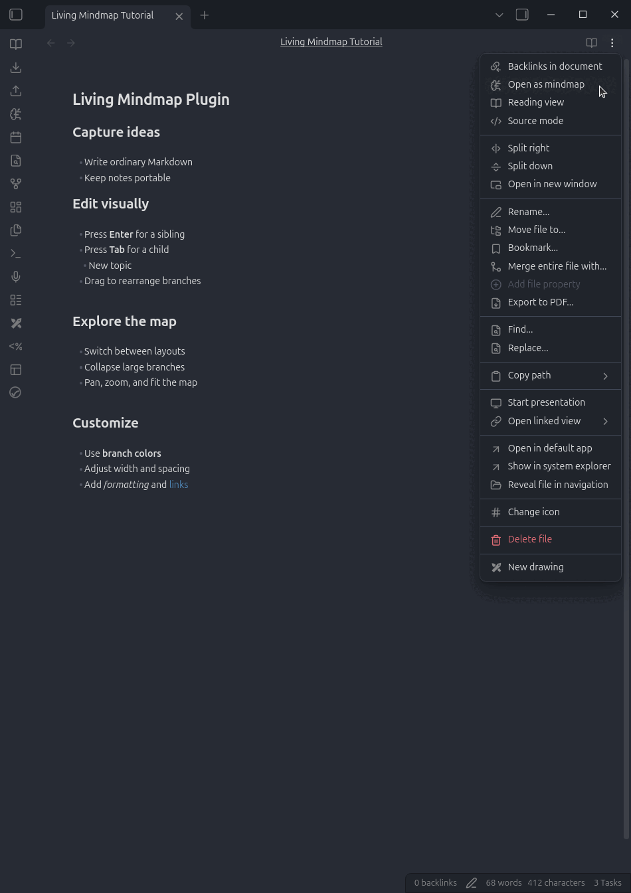

# Living Mindmap

A polished, directly editable mindmap view for ordinary Obsidian Markdown notes.

  

## Usage

Open a Markdown note and run **Living Mindmap: Open editable mind map**, or choose **Open as mindmap** from the document's three-dot menu.

On desktop, use the ribbon's **brain-circuit** icon or the command palette. On mobile, open the ribbon from Obsidian's sidebar or use the command palette.

## Commands and controls

### Selected nodes

These commands apply after clicking a node. Use Shift-click or a selection rectangle to apply formatting and deletion to multiple nodes.

| Input | Action |
| --- | --- |
| Double-click or `F2` | Start editing the primary selected node |
| `Tab` | Create a child |
| `Enter` | Create a sibling at the same level |
| `Ctrl+B` / `Cmd+B` | Toggle bold formatting on the selected nodes |
| `Ctrl+I` / `Cmd+I` | Toggle italic formatting on the selected nodes |
| `Delete` or `Backspace` | Delete the selected nodes and their descendants |
| `Ctrl+Z` / `Cmd+Z` | Undo the latest mindmap change |
| `Ctrl+Y` / `Cmd+Y` | Redo the latest mindmap change |

### Inline editing

These commands apply while the text editor is visible inside a node.

| Input | Action |
| --- | --- |
| `Enter` or `Tab` | Save the edit without creating another node |
| `Shift+Enter` | Save and create a sibling |
| `Shift+Tab` | Save and create a child |
| `Ctrl+B` / `Cmd+B` | Toggle bold formatting on the selected text |
| `Ctrl+I` / `Cmd+I` | Toggle italic formatting on the selected text |
| `Ctrl+Z` / `Cmd+Z` | Undo |
| `Ctrl+Y` / `Cmd+Y` | Redo |
| `Escape` | Cancel editing |

On Linux and Windows, use `Ctrl`. On macOS, use `Cmd`.

### Mobile and tablet

Tap a node to select it. The action rail appears along the upper-right edge of the screen.

| Input or control | Action |
| --- | --- |
| Tap a node | Select the node and show its actions |
| Double-tap a node | Edit its text |
| Drag an empty area with one finger | Pan the map |
| Pinch with two fingers | Zoom in or out |
| Edit | Open the selected node's text editor |
| Add child | Create and edit a child node |
| Add sibling | Create and edit a node at the same level |
| Delete | Delete the selected branch, with confirmation when it has descendants |
| Undo / Redo | Move backward or forward through mindmap changes |
| `+` / `−` on a node | Expand or collapse that branch |

While editing, use the on-screen controls for bold, italic, child, sibling, and Done. These controls work without a hardware keyboard.

### Canvas navigation and selection

| Input | Action |
| --- | --- |
| Click a node | Select only that node |
| Shift-click a node | Add or remove it from the current selection |
| Left-drag an empty area | Select multiple nodes with a selection rectangle |
| Right-drag an empty area | Pan the view |
| Mouse wheel | Zoom in or out |

### Drag and drop

Dragging a parent moves its complete descendant subtree. Dragging one node from a multi-selection moves the selected sibling branches together.

| Target area | Action |
| --- | --- |
| Center of a node | Make the moved branches children of that node |
| Top or bottom edge in Horizontal layout | Reorder siblings |
| Left or right edge in Vertical layout | Reorder siblings |

### Context menu

Right-click a non-title node to convert it between a Markdown heading and regular list content.

### Toolbar

| Control | Action |
| --- | --- |
| Fit map | Fit and center the complete mindmap in the viewport |
| Collapse/expand | Collapse every branch or expand them again |
| Compact branches | Toggle between globally aligned levels and local branch spacing |
| Branch colors | Toggle distinct colors for top-level branches |
| Layout | Switch between Horizontal and Vertical layouts |
| Dimensions | Adjust node width, hierarchy gaps, and sibling spacing |

## Settings

Mind-map preferences are global and stored in the plugin's `data.json`, not in note frontmatter. Toolbar changes update the same global settings immediately.

| Setting | Purpose |
| --- | --- |
| Layout | Choose Horizontal or Vertical rendering |
| Maximum node width | Set the width at which node text wraps |
| Spacing mode | Align levels globally or compact each branch locally |
| Branch colors | Color top-level branches and their connectors independently |
| Horizontal hierarchy gap | Set the distance between hierarchy columns |
| Vertical hierarchy gap | Set the distance between hierarchy rows |
| Sibling gap | Set the minimum distance between sibling subtrees |

Node text always wraps at the configured maximum width. Shorter nodes keep their natural compact width.

Enable **Compact branches** in the toolbar to keep parent-to-child gaps fixed within each branch. Disable it to align every depth into global columns.

Enable **Branch colors** in the toolbar to give each top-level branch its own node and connector color.

## Author

Created by [Chansocheat Tieng](https://github.com/Chansocheat-Tieng).
